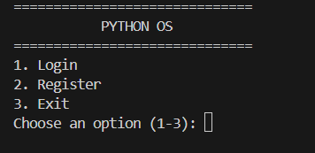
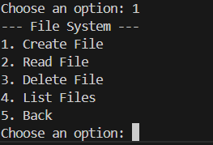
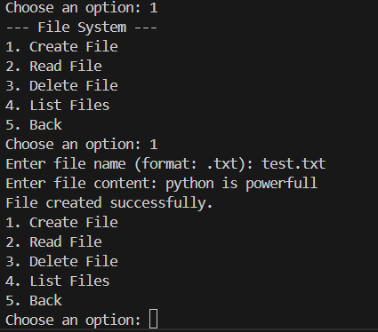
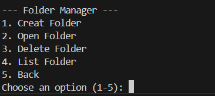
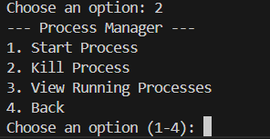
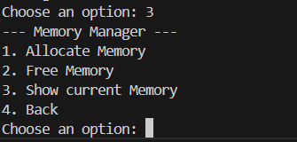
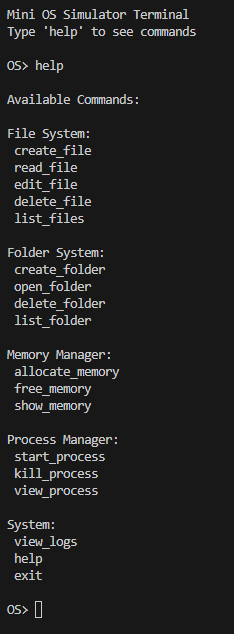
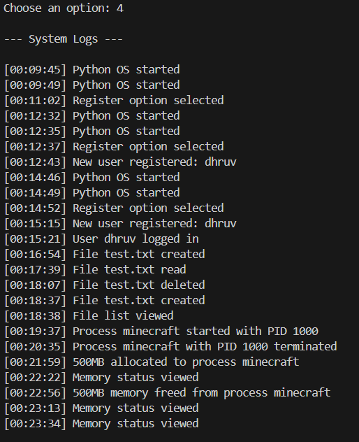

# OS Simulator

Two small command-line operating-system simulators built for learning and experimentation:

- **PyOS** — a modular Python CLI simulator with authentication, file and folder management, processes, memory, logs, and a terminal.
- **JsOS** — a JavaScript/Node.js terminal prototype with basic filesystem commands and system information utilities.

These projects simulate operating-system concepts in user space. They do not boot a real kernel or manage computer hardware.


## Screenshots

### System Start


### Main Menu


### File System


### Folder Manager


### Process Manager


### Memory Manager


### Terminal 


### System Logs



## Repository structure

```text
OS simulator/
├── PyOs/
│   ├── core/
│   │   ├── main.py          # Python OS entry point
│   │   ├── pos.py           # Login, registration, and main menu
│   │   ├── file_system.py   # Virtual file operations
│   │   ├── folder.py        # Folder operations
│   │   ├── process.py       # Process manager
│   │   ├── memory.py        # Memory manager
│   │   ├── cmd.py           # Python terminal
│   │   └── logger.py        # System event logging
│   └── data/
│       ├── users.txt        # Registered users
│       └── logs.txt         # System logs
├── JsOs/
│   └── core/
│       └── cmd.js           # JavaScript terminal prototype
├── LICENSE
└── README.md
```

## PyOS

### Features

- User registration and login using local text-file storage
- Virtual file creation, reading, editing, deleting, and listing
- Folder creation, opening, listing, and deletion
- Process creation, PID assignment, process listing, and termination
- Simulated 1024 MB memory allocation and release
- Event logging to `PyOs/data/logs.txt`
- Interactive terminal commands such as `ls`, `mkdir`, `touch`, `rm`, `clear`, `about`, `system_info`, and `uptime`

### Requirements

- Python 3.8 or newer
- No external Python packages are required

### Run PyOS

From the repository root:

```bash
python3 PyOs/core/main.py
```

On Windows, use:

```powershell
py PyOs/core/main.py
```

The program starts with login, registration, or exit options. After logging in, choose **Terminal Mode** to use the command interface.

### Python terminal commands

```text
ls                         List files
mkdir <folder>             Create a folder
touch <file>               Create an empty file
touch <folder>/<file>      Create a file inside a folder
rm <file>                  Remove a file
create_file                Create a file with content
read_file                  Read a file
edit_file                  Replace file content
delete_file                Delete a file
list_files                 List files
create_folder              Create a folder
open_folder                Open a folder
delete_folder              Delete a folder
list_folder                List folders and files
start_process              Start a simulated process
kill_process               Terminate a process by PID
view_process               Show running processes
allocate_memory            Allocate simulated memory
free_memory                Free simulated memory
show_memory                Show memory usage
view_logs                  View system logs
system_info                Show system information
about                      Show project information
uptime                     Show session uptime
clear                      Clear the terminal
exit                       Leave the terminal
```

PyOS stores user accounts and logs locally. Do not use real passwords in `PyOs/data/users.txt`; this is an educational simulator, not a secure authentication system.

## JsOS

### Features currently implemented

- `ls` — list directory contents
- `mkdir` — create a folder
- `touch` — create a file
- `rm` — remove a file
- `cat` — print file contents
- `nano` — save file content
- `clear` / `cls` — clear the console
- `uptime` — display running time
- `sysinfo` and `sysabout` — display system details
- `exit` — stop the uptime display

### Requirements

- Node.js with ES module support (Node.js 18 or newer recommended)
- No external npm packages are required

### Run JsOS

From the repository root, create the JavaScript data directory first:

```bash
mkdir -p JsOs/data
node --experimental-default-type=module JsOs/core/cmd.js
```

The current JavaScript implementation uses ES modules and is a command class/prototype rather than a full interactive command loop. The file includes example calls at the bottom that create `test.txt`, create a `state` directory, and save `file.txt` in `JsOs/data`. Individual commands can be enabled or called from code as the prototype is extended.

## Concepts demonstrated

- Modular program structure
- Object-oriented programming
- Command-line interfaces
- File and directory handling
- Local persistence
- Process and memory state simulation
- Logging and basic system diagnostics

## Limitations

This project is intentionally simple. It does not provide kernel isolation, real CPU scheduling, hardware access, secure password hashing, permissions, or persistent process/memory state across restarts.

## License

See [LICENSE](LICENSE).
